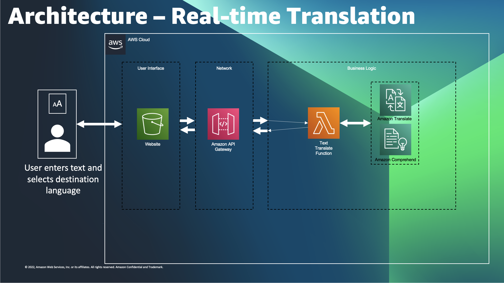
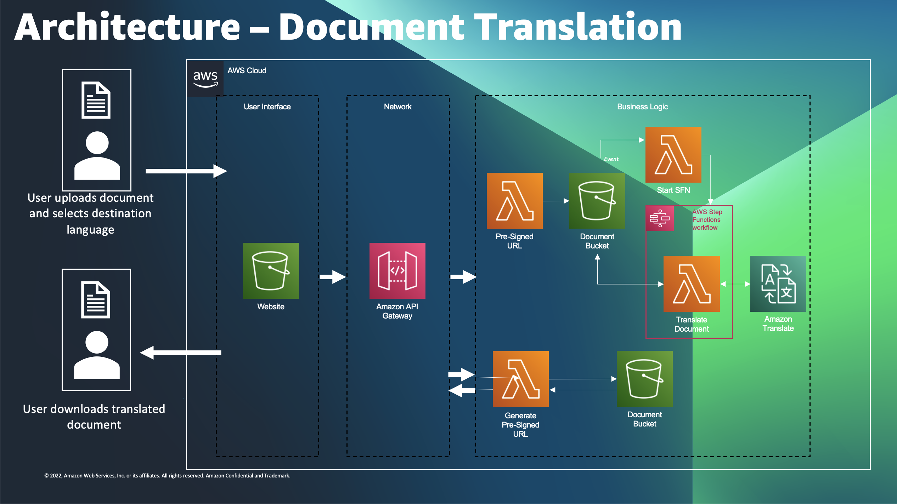
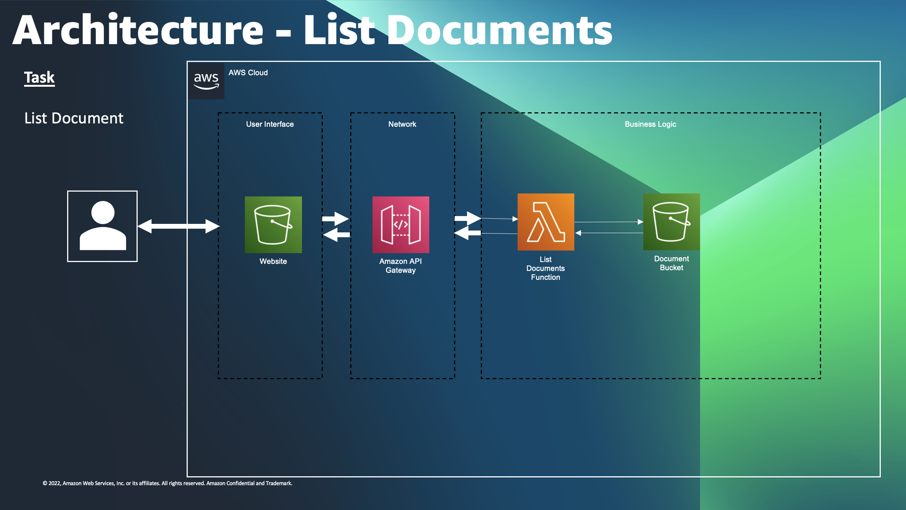
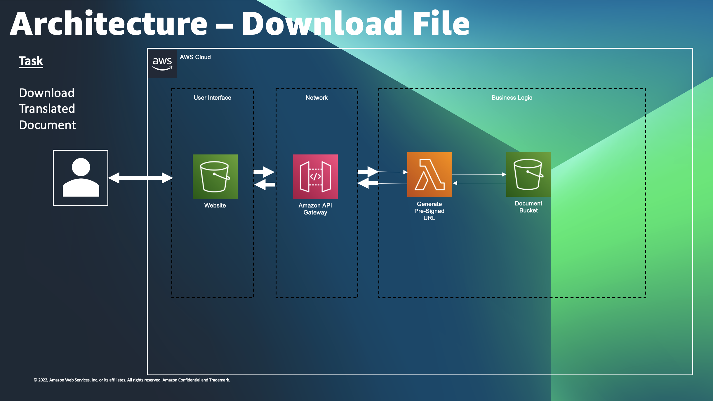
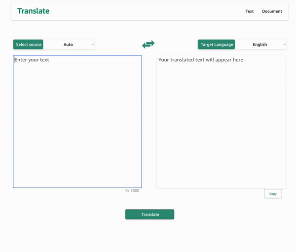
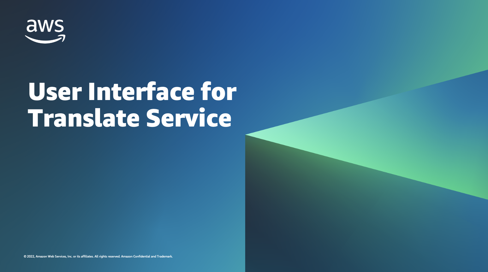

# Translate UI

## Problem Statement

- Some customers want to take advantage of AWS services without or don’t have access to AWS console or using the SDKs.
- Customers want to leverage AWS services in a low frictionless manner (browsing a websites or integrated into existing applications), rather than having to build and integrate their own custom code for each service.
- Customers have limited access to certain services due to Security & Compliance and therefore require a solution to help meet their mission

 

## Design Considerations  

<u>Build front-end for Amazon Translate</u>

|Category                          |Considerations                                                                                                                                                                                                                                 |
| ------------------------ | ------------------------------------------------------------------------------------------------------------------------------------------------------------------------------------------------------------------------------- |
| System Inputs & Outputs  | 1) Perform Text and Document Translations 2) Allow user selection of destination language and support real-time output of translation text   3) Storage of translated documents for download   4) Automated Deployment |
| Artifacts and Deployment | 1) Provide a code repository for customer prototype and version control   2) Automated Deployment                                                                                                                            |
| Architecture             | 1) Cost-Efficient architecture   2) Scalable and Secure best practices                                                                                                                                                       |

 

## Architecture   

Infrastructure has been hosted on AWS Cloud by using various AWS services(as seen in the architecture below) and other IaC services like AWS CDK. We've implemented AWS Well-Architected Framework in designing this serverless-architecture to help meet scale, cost and less-operational overhead.React Framework has been used to develop the front-end of this application. <i>
Please view specific READ.ME for further information
</i>  

<i>Architecture of translating text in real-time  

 Architecture of translating document (upload -> store -> translate)  

 Architecture of retrieving list of translated documents   

 Architecture of downloading a translated document</i>   

  

## User-Interface  

<i>Demo #1 - Performing Text Translation in Real-Time   

  Demo #2 - Performing Document Translation in Near real-Time   </i>

  

## Presentation

https://user-images.githubusercontent.com/88688048/188034339-5526652b-9b6c-4a3c-b9f6-e58f1d19ef2a.mp4

## Roadmap

* Improve UI & address bugs
* Authentication
* Comprehend & Polly
* Image Translation  

## Authors and acknowledgment

|Role|Name|Alias|
|-|-|-|
|Owner|Umangkumar Patel|@ukpatel|
|Project Mentor| David Gleason|@gleasods|

 

## Project Status 
|Version|Status|
|-|-|
|Initial Version (this)|<i>Completed</i>|

 

## Other 

|File|Information|
|-|-|
|Backlog.md|This file contains detailed information about the future work and other potential items that needs to be addressed in the next phase|
|website|This folder is our <u>Front End (React)</u> Please visit to make any changes & includes README.md for more information|
|translate-service|This folder is our <u>Backend (CDK-Python).</u> Please visit its README.md to get started and learn more|
|NestedStack.zip|This archive contains extra code that was used to split the translate-service stack into NESTED STACKS by each resource. It has a circular dependency issue with IAM & S3 Notification. It is 95% similar to working copy, but please ensure that it is accurate before utilizing it|
|assets|This folder contains assets of this project/directory|

---
## FAQs
<i>What is an estimated cost of this architecture?</i> 
- Cost will vary by region and availability of services. Please view attached video to understand the costs

<i>What were some of the biggest challenges in completing this project?</i> 
- Solving this using services that are available at hand in a way that can be provisioned using IaC services

<i>How are we handling document translation?</i> 
- We're using same API for text translation but we're chunking the file as best as possible and appending the translation while ensuring meaning of the sentence isn't lost

<i>Why take the server-less approach?</i> 
- It's easy to scale, less over-head management and cost-effective

<i>How long does it take to translate a single-document?</i> 
- There are variety of factors that could affect the performence(time). However, it takes at-most 1 minute to translate a single, text document (5-10kb)
